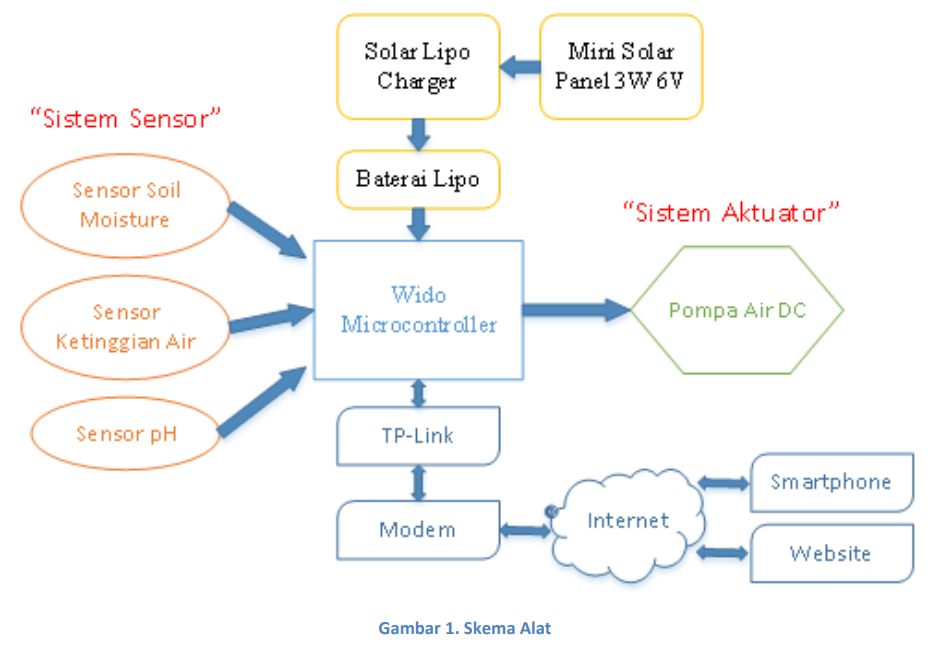

# Caresoil
IoT system for monitoring and control soil condition

Faktor kualitas tanah adalah salah satu faktor yang mempengaruhi kualitas
tanaman yang baik. Permasalahan saat ini adalah jarang diketahuinya kualitas tanah
dari lahan pertanian oleh petani. Petani hanya menebak kualitas tanah menggunakan
pengalaman yang dimilikinya. Namun akan lebih baik ketika parameter kualitas tanah
diukur dan diketahui nilainya secara pasti. kelembaban tanah dan pH tanah adalah
contoh parameter kualitas tanah. Untuk bisa menghasilkan tanaman yang kualitasnya
baik diperlukan sistem yang dapat memonitoring dan mengendalikan kualitas tanah.
Caresoil merupakan alat yang dapat memonitoring dan mengendalikan kualitas tanah.
Caresoil dapat diakses dimana saja dan kapan saja menggunakan akses internet dan
smartphone. Dengan begitu petani tidak harus selalu mengecek kondisi tanah dengan
langsung, tetapi bisa memanfaatkan Caresoil. Alat ini diharapkan bisa dimanfaatkan
secara universal untuk segala jenis tanah dan segala jenis tanaman.

Pertama Caresoil terdiri dari sistem sensor yang terdiri dari sensor soil moisture,
sensor ketinggian air, dan sensor pH. Dari ketiga sensor inilah diketahui karakteristik
dari kualitas tanah dan ketinggian air di irigasi. Dari ketiga sensor ini akan dilakukan
akuisisi data oleh Wido microcontroller. Data dari sensor ini akan diolah sesuai dengan
algoritma yang telah diprogramkan. Wido microcontroller akan menghidupkan sistem
aktuator berupa pompa air DC ketika diperlukan. Wido microcontoller dayanya akan
disuplai oleh baterai lipo dan solar cell sehingga daya yang digunakan dapat mandiri.
Untuk proses kontrol dan monitoring, Wido disambungkan ke TP-Link yang kemudian
disambungkan ke internet menggunakan modem. Dari internet inilah yang akan
diintegrasikan ke software Smartphone dan website. Dari smartphone dan website, kita
bisa monitoring kondisi lahan secara langsung dan dapat mengendalikan aktuator
pompa.

